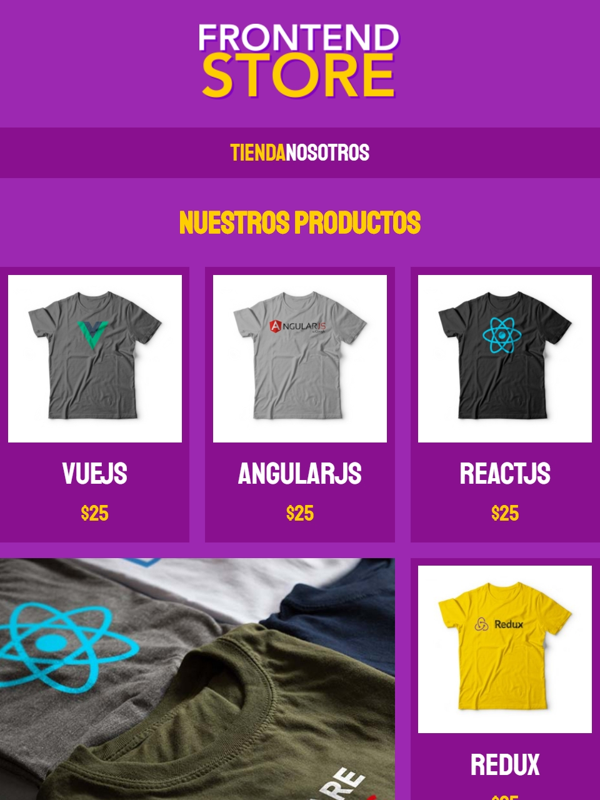
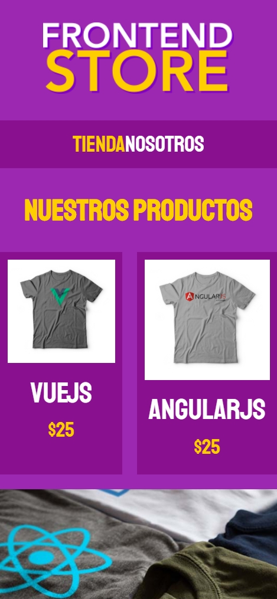
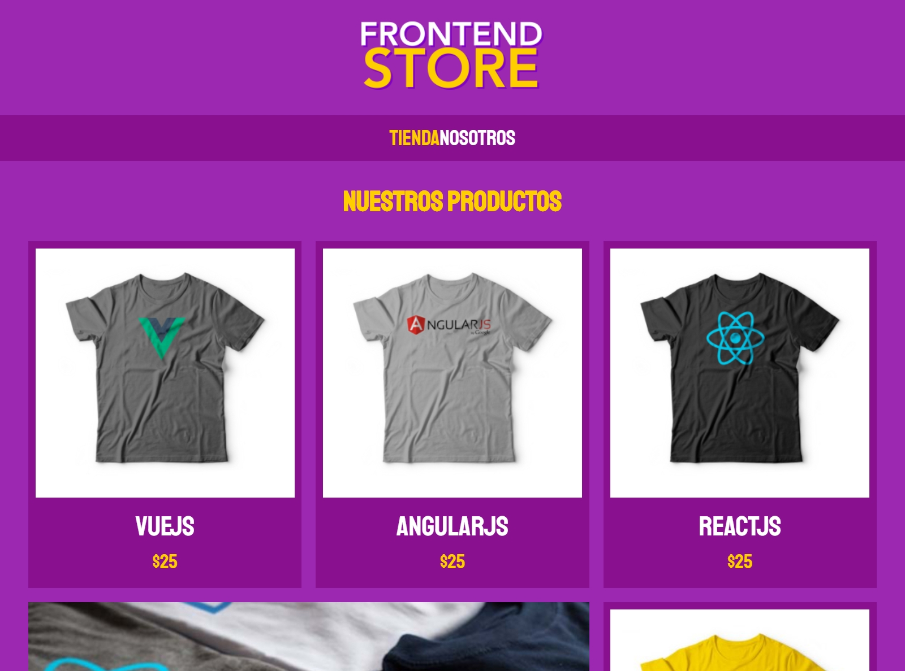

# FrontEnd Store (Responsive)
Diseño de una tienda online sencilla construida con HTML y CSS.

Se aplicó la metodología **BEM CSS** con el objetivo de dar mucha más transparencia y claridad en la estructura HTML y CSS.

BEM son tres siglas.

- **B** de bloque.
- **E** de elemento.
- **M** de modificador.

Un **bloque** es una sección independiente que tiene significado propio por sí solo.
Contiene todos los nodos HTML de una estructura a la que te estés refiriendo. 

```html
<div class=“cliente”>...</div>
```
```css
.cliente {....}
```

Un **elemento** es parte de un bloque. Se usa para ir dividiendo el bloque en segmentos más pequeños.

```html
<p class=“cliente__nombre”>...</p>
```
```css
.cliente__nombre {....}
```

Un **modificador** sirve para modificar algunas propiedades de un bloque o elemento.

```html
<p class=“cliente__nombre--ceo”>...</p>
```
```css
.cliente__nombre--ceo {....}
```


## Capturas de pantalla

#### iPad (768x1024):


#### iPhone X (375x812):


#### Generic Laptop (1280x950):


## Visualiza el diseño en:
https://frontendstore-shu.netlify.app/
